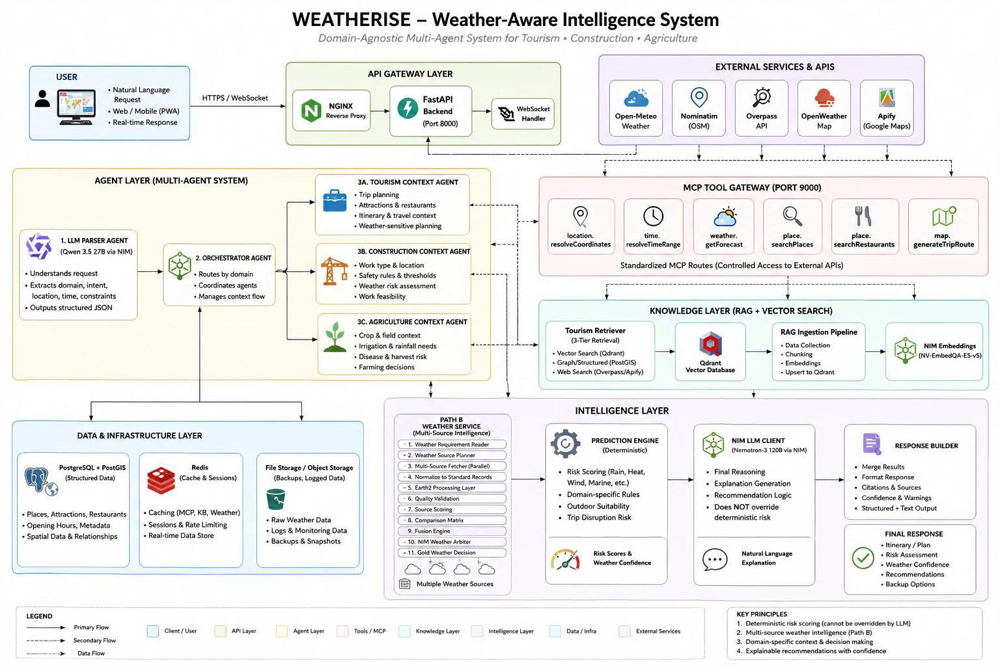
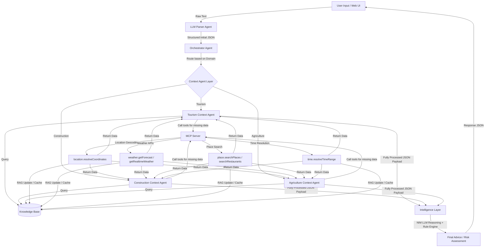
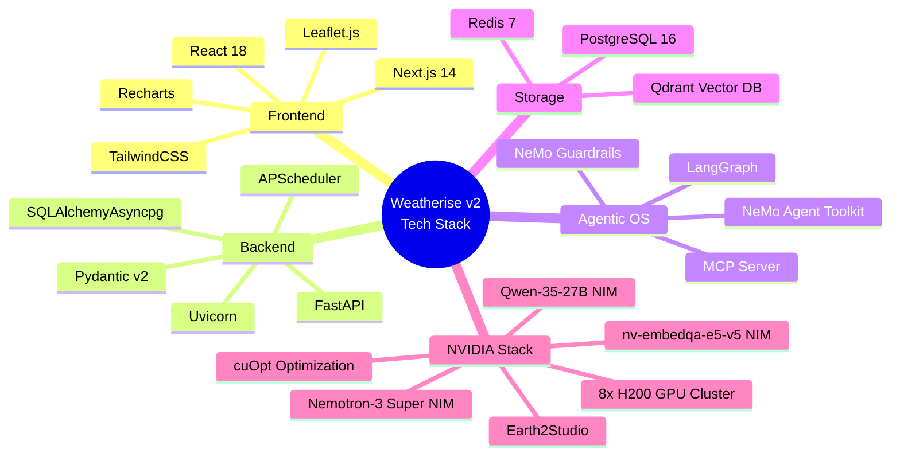

# 🌦️ Weatherise — Multi-Agent System for Multi-Domain Optimization in Da Nang City

> **Team:** Weatherise (4 members)  
> **Role:** Developed under the direction of **Team Lead**  
> **Platform:** Responsive Web Application (PWA) & Agentic Backend  
> **Infrastructure:** Optimized for **8x NVIDIA H200 GPU Cluster** with **NVIDIA NeMo Agent Toolkit** integration.

---

## 📋 Table of Contents
1. [Project Overview](#1-project-overview)
2. [Development Team](#2-development-team)
3. [Core Features](#3-core-features)
4. [System Architecture](#4-system-architecture)
5. [Tech Stack](#5-tech-stack)
6. [Deployment Guide](#6-deployment-guide)
7. [Database Seeding](#7-database-seeding)

---

## 1. Project Overview

**Weatherise** is a **domain-aware Multi-Agent System (MAS)** that integrates real-time weather intelligence and physical risk models to deliver optimal decision-making and planning. 

The platform is architected as a **reusable domain-agnostic framework**. By adapting the Knowledge Base and risk rule engine, it seamlessly transitions across diverse sectors:
* **Smart Tourism:** Formulates optimized daily itineraries based on personal preferences, real-time crowding data, and weather forecasts.
* **Urban Construction:** Evaluates physical weather hazards (rain, temperature, wind gusts) for concrete pouring, high-altitude crane operations, and heavy lifting.
* **Precision Agriculture:** Prescribes irrigation, fertilization, and harvesting windows based on soil moisture levels and short/medium-range forecasts.

---

## 2. Development Team

Developed by **Team Weatherise** under a professional team structure:

* **Team Lead:**
  * Defines strategic vision, drafts system architecture, and models the multi-agent workflows.
  * Directs task distribution, manages integration schedules, and validates operational readiness.
  * Architected the RAG matching pipeline and NVIDIA NIM integration.
* **Backend & Agents Engineers (2 members):**
  * Built the core LangGraph state machine and implemented individual context agents (Tourism, Construction, Agriculture).
  * Built the MCP Server for dynamic external tool integrations and storage connections (PostgreSQL, Qdrant, Redis).
* **Frontend Engineer (1 member):**
  * Developed the Next.js 14 responsive PWA, integrating interactive Leaflet maps and Recharts weather visualizations.

---

## 3. Core Features

* 🔮 **Natural Language Parsing:** Leverages LLM Parser NIM to translate unstructured prompts into schema-validated search objects (intent, time, location, constraints).
* 🚦 **Intelligent Orchestration:** Utilizes **LangGraph** to model state-driven agent navigation, routing user requests dynamically to domain-specific context agents.
* 🌐 **Model Context Protocol (MCP):** Connects agents to external API resources via a unified MCP gateway, fetching live coordinates, weather forecasts, and attraction databases.
* 🧠 **Dual-Layer Risk Evaluation:** Combines a deterministic rule-based prediction engine (for hard safety boundaries) with NIM LLMs (for soft personalized logic).
* 🚨 **Weather Watcher & Auto-Replanning:** Runs background tasks to monitor forecast updates, pushing SMS alerts via SpeedSMS and triggering automatic route re-planning upon hazardous weather detections.
* 🖨️ **Visual Export:** Generates high-quality offline itinerary cards complete with embedded QR codes.

---

## 4. System Architecture

### 📊 Architecture Block Diagram

The system comprises containerized microservices routed through an Nginx reverse proxy:



---

### 🔄 Runtime Execution Flow

The sequence below illustrates the end-to-end data lifecycle:



---

## 5. Tech Stack

### 🛠️ Core Technology Components



| Layer | Component | Description |
| :--- | :--- | :--- |
| **Frontend** | **Next.js 14 (App Router)** | Powers the responsive PWA with Leaflet maps and Recharts dashboards. |
| **Backend** | **FastAPI** | High-performance API Gateway with WebSocket streaming and background scheduler. |
| **AI Orchestration**| **LangGraph & NeMo Agent Toolkit** | Manages multi-agent workflow routing and enforces safety guardrails. |
| **Foundation Models**| **NVIDIA NIM** | Hosts Nemotron-3 Super 120B, nv-embedqa-e5-v5, and Qwen-35-27B. |
| **Storage** | **Qdrant, PostgreSQL, Redis** | Qdrant for RAG vector search; PostgreSQL for relational logs; Redis for caching. |
| **GPU Engine** | **NVIDIA cuOpt & Earth2Studio** | cuOpt runs routing algorithms; Earth2Studio manages Earth-2 forecasts. |

---

## 6. Deployment Guide

### Prerequisites
* Docker and Docker Compose installed.
* NGC API Key for accessing NVIDIA NIM services (or pre-launched local NIM containers).

### Step 1: Set Up Environment Variables
Copy the template configuration file:
```bash
cp .env.example .env
```
Open `.env` and populate the keys:
* `NGC_API_KEY`: Your NVIDIA NGC API access token.
* Add key credentials for weather services (e.g. `OPENWEATHERMAP_API_KEY`) if fallbacks are needed.

### Step 2: Launch with Docker Compose
Start all containers in detached mode:
```bash
docker-compose -f infra/docker-compose.yml up -d
```
Verify container status:
```bash
docker ps
```
The application will be accessible via the Nginx Reverse Proxy on port `8080`:
* **Web Client:** `http://localhost:8080/`
* **API Gateway:** `http://localhost:8080/api`
* **WebSocket Endpoint:** `ws://localhost:8080/ws`

---

## 7. Database Seeding

Seed PostgreSQL schema and Qdrant RAG collections:

1. **Initialize Relational Database:**
   ```bash
   docker exec -i weatherise-postgres psql -U weatherise -d weatherise < storage/postgres/locations_schema.sql
   docker exec -i weatherise-postgres psql -U weatherise -d weatherise < storage/postgres/context_observability_tables.sql
   ```

2. **Run Python Seeding Script:**
   ```bash
   python knowledge/scripts/seed_all.py
   ```

Your Weatherise platform is now fully synchronized and operational!