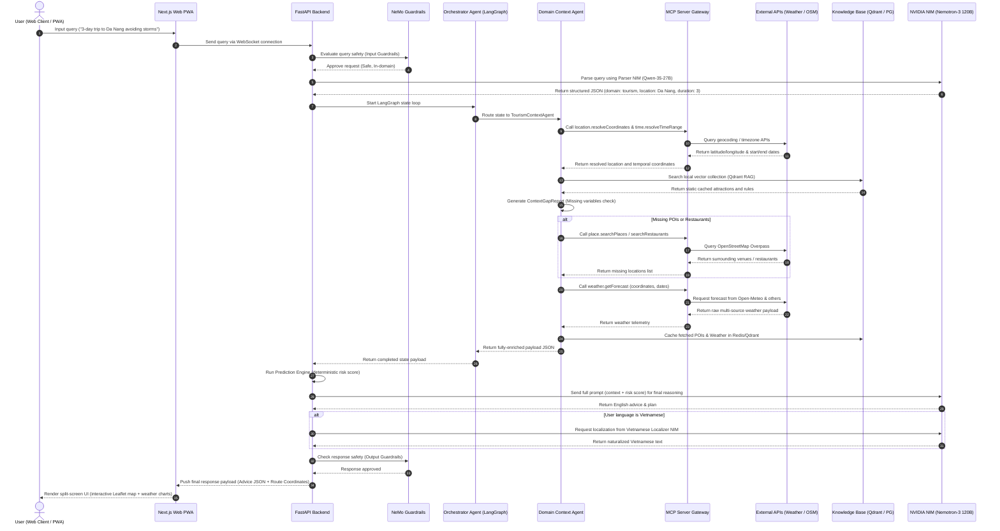
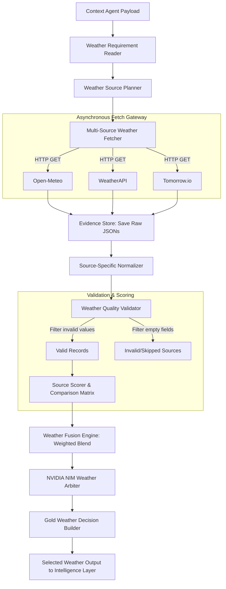

# 🔄 Data Flow & Data Sources — Weatherise v2

This document details the data sources, runtime data routing, and processing pipelines within the **Weatherise v2** platform, hosted on an **8x NVIDIA H200 GPU Cluster** and orchestrated using **NVIDIA NeMo Agent Toolkit**.

---

## 1. Data Sources Map

The Weatherise platform aggregates static, dynamic, and AI-modeled data to establish rich operational contexts:

| Data Type | Provider | Access Protocol | System Role / Purpose |
| :--- | :--- | :--- | :--- |
| **Multi-Source Weather Forecast** | Open-Meteo, OpenWeatherMap, WeatherAPI, Tomorrow.io, Visual Crossing, 7Timer, StormGlass | REST API via **MCP Server** | Provides hourly temperature, precipitation probability, humidity, wind speed, wind gusts, UV index, and storm risk. |
| **Live Local Weather** | Open-Meteo API | Direct HTTPS REST fetch | Powers the home screen clock and live weather widgets for Da Nang, Hanoi, and Ho Chi Minh City. |
| **Geographical Geocoding** | Nominatim / OSM | MCP Location Tool (`resolveCoordinates`) | Resolves user-entered locations (e.g. *"Son Tra Peninsula"*) into latitude and longitude coordinates. |
| **Point of Interest (POI) Database** | OpenStreetMap (OSM) Overpass API | MCP Place Tool (`searchPlaces`) | Sours tourist attractions, museums, and historical landmarks surrounding resolved coordinates. |
| **Restaurant Databases** | PostgreSQL / OSM Overpass API | MCP Place Tool (`searchRestaurants`) | Sours food venues for localized clusters to minimize itinerary transit distances. |
| **Temporal Parsing** | Python Datetime Logic | MCP Time Tool (`resolveTimeRange`) | Translates conversational time targets (e.g., *"next weekend"*) into concrete calendar dates. |
| **Domain-Specific KB (RAG)** | Qdrant (Vector DB) & PostgreSQL | Vector Similarity Search (NIM Embed) | Holds safety margins, regulatory thresholds, historical climates, and tourist articles. |
| **Caching & Session Storage** | Redis 7 (Alpine) | Key-Value Cache (TTL 1 hour) | Caches external API responses to prevent rate-limiting, and stores active WebSocket session data. |

---

## 2. Overall Runtime Data Flow Diagram

The following detailed sequence diagram illustrates the lifecycle of a query from the Web interface to final output:

---

## 3. Detailed Runtime Processing Stages

### Stage 1: Parsing and intent extraction (Parsing Stage)
When a raw natural language query is submitted, it is processed by the **Qwen-35-27B Parser NIM** running on the H200 GPU cluster. The output is a validated JSON structure specifying:
* **Location** (`location`): Extracted target city or region.
* **Temporal Range** (`time_range`): Start and end dates computed from natural phrasing.
* **Operational Domain** (`domain`): Identified industry sector (`tourism`, `construction`, or `agriculture`).
* **User Constraints** (`user_constraints`): Explicit constraints (e.g. *"avoid rain"*, *"outdoor activity only"*).

### Stage 2: Routing & Context Enrichment
The **Orchestrator Agent** (modeled in LangGraph) takes the structured JSON and routes it to the corresponding context agent. The agent executes a multi-step enrichment pipeline:
1. **Coordinates Resolution:** Calls MCP Server (`location.resolveCoordinates`) to get latitude and longitude.
2. **Temporal Resolution:** Calls MCP Server (`time.resolveTimeRange`) to align raw texts to concrete ISO dates.
3. **Knowledge Base Search:** Query local Qdrant vectors and PostgreSQL database schemas to pull static rules, historical risks, and offline entities.
4. **Context Gap Recovery:** Evaluates the retrieved data. If the POI or restaurant counts are below acceptable thresholds (sparse results), it fires dynamic fallbacks (`place.searchPlaces`, `place.searchRestaurants`) to fetch live OSM nodes.

### Stage 3: Risk Assessment & Reasoning (Intelligence Layer)
The gathered context is forwarded to the **Intelligence Layer**:
* **Rule Engine:** Calculates hard physical risk ratings (RAIN, WIND, HEAT) based on domain thresholds (e.g., concrete pouring temperature limits, crane wind gust limits).
* **NIM LLM Reasoning:** Inputs the validated weather data, site parameters, and calculated risk metrics into the **Nemotron-3 Super 120B NIM** to draft personalized plans and safety recommendations.
* **Localization Engine:** If the input language is identified as Vietnamese, a final localization pass is performed using **Qwen-35-27B** to ensure professional, culturally fluent phrasing.

---

## 4. Path B Weather Consensus Ingestion Pipeline

To protect the system against weather provider outages or false telemetries, Weatherise v2 uses the **Path B Weather Consensus** pipeline:

1. **Requirements Analysis:** Reading the required physical weather variables (e.g. soil moisture for farming, wind gusts for crane operations).
2. **Dynamic Ingestion Planning:** Deciding which weather APIs to query based on regional reliability and cost.
3. **Evidence Ingestion:** Querying all selected APIs asynchronously via MCP and saving the raw JSON responses into the `weather_evidence` audit directory.
4. **Normalization & Quality Validation:** Normalizing diverse schemas into unified hourly records, testing for out-of-bound errors, and discarding failed sources.
5. **Consensus Arbitration:** Computing a weighted fusion of all valid forecasts, and passing the comparison matrix to a **NIM Weather Arbiter** to select the single most accurate consensus (Gold Weather Decision).

---

## 5. GPU Acceleration and Security Enforcements

### ⚡ Infrastructure: 8x NVIDIA H200 GPU Cluster
* **Parallel Token Generation:** Splitting the large **Nemotron-3 Super 120B** across 4 GPUs (TP=4) enables sub-second token generation speeds, eliminating typical multi-agent system latency bottlenecks.
* **High-Throughput Routing:** Dedicated GPUs for embedding generation and route optimization (via **NVIDIA cuOpt**) ensure the backend can process complex itineraries concurrently.

### 🛡️ Orchestration Security: NeMo Agent Toolkit & Guardrails
* **NeMo Agent Toolkit:** Enforces strict parameter validation schemas and secure execution boundaries for all agent tools, preventing malicious environment escapes.
* **NeMo Guardrails:** Wraps the system in dual security layers:
  * **Input Level:** Automatically blocks SQL injection attempts, prompt jailbreaks, and out-of-domain conversational queries.
  * **Output Level:** Audits the generated advice text to prevent factual hallucinations, ensuring all weather warnings adhere strictly to pre-defined safety rules.
