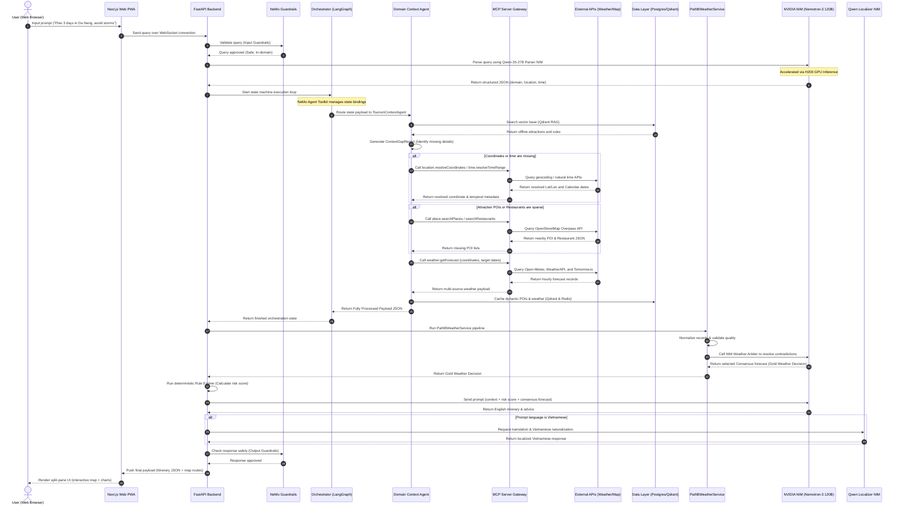

# 📊 Sequence Diagram — Weatherise v2

This document details the execution flow of the **Weatherise v2** system, detailing how requests are parsed, enriched, evaluated for weather risk, and returned to the user. All services are optimized for the **8x NVIDIA H200 GPU Cluster** and orchestrated via **NVIDIA NeMo Agent Toolkit**.

---

## 1. System Execution Sequence Diagram

The sequence diagram below shows how a user's natural language request moves through the system:

---

## 2. Component Interactions Breakdown

### A. Input Verification (NeMo Guardrails)
Before any LLM calls occur, **NeMo Guardrails** evaluates the incoming string. It blocks SQL injections, script inputs, and questions unrelated to weather, construction, agriculture, or tourism. This step saves H200 GPU resources by filtering out invalid traffic.

### B. Natural Language Parsing
The **Qwen-35-27B Parser NIM** runs on two H200 GPUs. It processes unstructured inputs to extract key parameters (e.g., location name, calendar date range, domain, and constraint strings) and returns them in a structured JSON schema.

### C. Context Enrichment
The routed **Context Agent** evaluates the parser outputs. If details are missing or databases return sparse results, the agent resolves them using the **MCP Server**:
* Geocodes location text to latitude and longitude.
* Translates conversational dates into ISO strings.
* Queries external search engines for tourist spots, construction site info, or agricultural cooperatives.
* Downloads weather telemetry forecasts from multiple providers.

### D. Path B Weather Consensus
The **PathBWeatherService** processes forecasts from multiple providers:
* **Normalizer:** Standardizes different API formats into a single schema.
* **Validator:** Checks for out-of-bounds metrics (e.g., negative wind speeds) and removes faulty sources.
* **Arbiter:** Sends the comparison data to **Nemotron-3 Super 120B** to select the most reliable forecast (Gold Weather Decision).

### E. Reasoning Layer
The **Nemotron-3 Super 120B NIM** processes the final system prompt. It combines the Gold Weather Decision, local rules, and POI details to generate safe, personalized recommendations.

### F. Output Verification (NeMo Guardrails)
Before the response is returned to the user, NeMo Guardrails scans the generated text. It verifies that the advice aligns with safety rules and does not contain factual errors or hallucinations.

### G. Client Presentation
The **Next.js Web PWA** receives the JSON response and displays it. It renders path coordinates on a Leaflet map and plots weather metrics (nhiệt độ, mưa, gió) on Recharts graphs.
