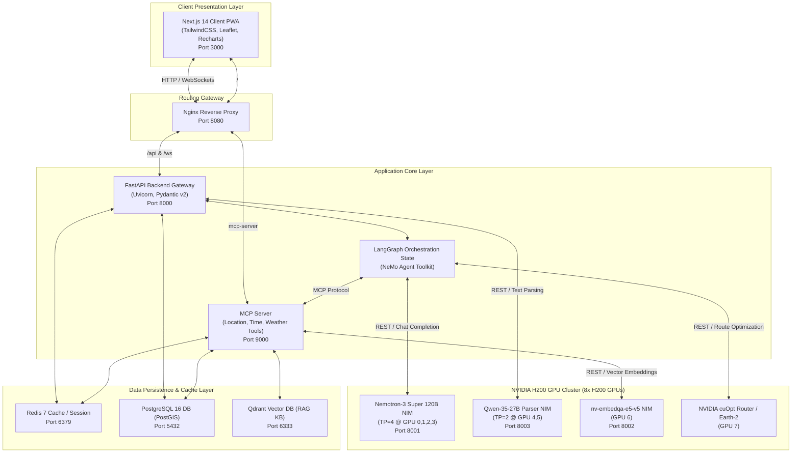

# 🏗️ System Architecture — Weatherise v2

This document details the system architecture of the **Weatherise v2** platform, explaining how the containerized microservices interact, how the multi-agent system is orchestrated via **NVIDIA NeMo Agent Toolkit**, and how services are scheduled across the **8x NVIDIA H200 GPU Cluster**.

---

## 1. Overall System Architecture

The Weatherise platform is built using a containerized microservices architecture. Traffic is managed and routed internally through an Nginx reverse proxy.



---

## 2. Component Design & Responsibilities

### A. Frontend Presentation Layer
* **Next.js 14 PWA:** Provides a responsive mobile-first interface. Uses Server-Side Rendering (SSR) for initial loads and static pages optimization.
* **Leaflet.js Map:** Renders optimal geographical routes, location markers, and custom hazard zones based on weather safety parameters.
* **Recharts Dashboards:** Displays interactive graphs showing forecasted temperature ranges, rainfall intensity, and wind speed trends over the target time frame.

### B. FastAPI Backend (Application Gateway)
* **REST & WebSockets Gateway:** Exposes HTTP endpoints for synchronous actions and WebSocket connections for real-time streaming of multi-agent execution steps.
* **Background Watcher Service:** Houses the **Weather Watcher** task (scheduled using APScheduler), which checks coordinates for active warnings and sends SMS notifications via SpeedSMS if risk thresholds are breached.
* **Risk Rule Engine:** Runs a fast, deterministic checker to score physical risks (LOW, MEDIUM, HIGH) against domain parameters (concrete pouring, farming, or tourism safety tables).

### C. Model Context Protocol (MCP) Server
* **MCP Server Gateway:** Runs Anthropic's Model Context Protocol, hosting tools that can be invoked dynamically by LLMs:
  * `location.resolveCoordinates`: Geocodes city or landmark strings.
  * `time.resolveTimeRange`: Translates natural terms (*"next weekend"*) to calendar spans.
  * `weather.getForecast`: Aggregates hourly meteorological forecasts.
  * `place.searchPlaces` & `place.searchRestaurants`: Returns localized attractions and restaurants.
  * `agriculture.getLiveTelemetry` / `construction.getLiveTelemetry`: Reads real-time sensors (soil dampness, wind gusts).

### D. AI Orchestration Layer
* **LangGraph State Machine:** Defines the execution nodes and conditional edges for context gathering. Tracks the dialogue state across turns.
* **NVIDIA NeMo Agent Toolkit:** Binds the LLMs to MCP tools safely. Translates the LangGraph state actions into secure executable tool calls.
* **NeMo Guardrails:** Validates prompt domains (blocking general chatbot questions) and audits generated advice against security policies.

### E. Persistence Layer
* **PostgreSQL 16 (PostGIS):** Stores user account data, relational log tables, and geographic coordinates of attractions and sites.
* **Qdrant Vector DB:** Stores the static knowledge base (historical weather, guidelines, articles) as high-dimensional vectors for semantic RAG lookups.
* **Redis 7:** Stores active WebSocket connections and caches geocoded coordinates and external weather forecasts (TTL 1 hour) to reduce API latency.

---

## 3. NVIDIA H200 GPU Cluster Deployment (8x GPUs)

To handle heavy LLM reasoning and routing tasks concurrently, the backend resources are divided across **8x NVIDIA H200 GPUs** (using **NVIDIA Container Toolkit**):

* **GPUs 0, 1, 2, 3 (Tensor Parallel TP=4):** Hosts **Nemotron-3 Super 120B NIM** (`nvidia/nemotron-3-super-120b-a12b`). This 120B parameter model requires 4 clustered H200 GPUs to achieve optimal inference speeds, handling complex reasoning and weather arbitration.
* **GPUs 4, 5 (Tensor Parallel TP=2):** Hosts **Qwen-35-27B NIM** (`weatherise-parser-qwen35-27b`). This model is dedicated to parsing natural language prompts and localizing final recommendations into fluent Vietnamese.
* **GPU 6:** Hosts **nv-embedqa-e5-v5 NIM** (`nvidia/nv-embedqa-e5-v5`). Computes embeddings for incoming user queries and RAG documents locally, saving network roundtrips.
* **GPU 7:** Allocated for **NVIDIA cuOpt** routing and **Earth2Studio** forecasting. cuOpt uses GPU parallelization to solve multi-stop vehicle routing/traveler planning problems in milliseconds.

---

## 4. Docker Network Topology & Port Routing

All core microservices are defined in `infra/docker-compose.yml` and connect via an internal network:

```yaml
services:
  nginx:
    ports:
      - "8080:80"        # Main public portal routing
  web:
    ports:
      - "3000:3000"      # Node Next.js Server (internal-only)
  api:
    ports:
      - "8000:8000"      # FastAPI Uvicorn Server (internal-only)
  mcp-server:
    ports:
      - "9000:9000"      # MCP FastAPI service (internal-only)
  vector-db:
    ports:
      - "6333:6333"      # Qdrant Database (internal-only)
  redis:
    ports:
      - "6379:6379"      # Redis Key-Value Store (internal-only)
  postgres:
    ports:
      - "5432:5432"      # PostgreSQL Database (internal-only)
```

The NVIDIA NIM models and optimization engines run directly on the host machine to allow direct hardware access. Containers resolve these models using the Docker default gateway address `host.docker.internal` (mapped via `extra_hosts` in the compose configuration).
