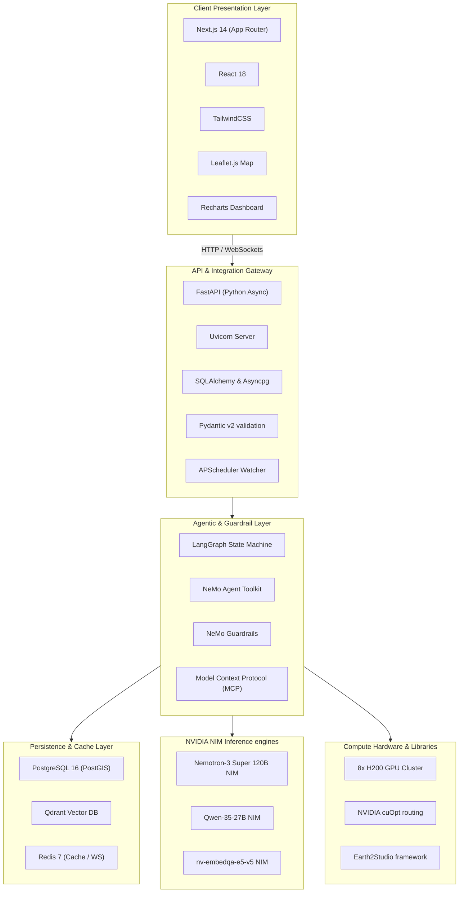

# 🛠️ Technology Stack — Weatherise v2

This document details the hardware and software technology stack used in **Weatherise v2**. The platform is optimized for deployment on an **8x NVIDIA H200 GPU Cluster** and leverages the **NVIDIA NeMo Agent Toolkit** for multi-agent coordination.

---

## 1. Tech Stack Overview

The diagram below highlights the layered technology stack of the system:

---

## 2. Component Specifications

### A. Frontend Presentation
* **Next.js 14:** Powers the client interface. Server-Side Rendering (SSR) ensures fast loading times, and client-side page routing provides a smooth app experience.
* **TailwindCSS:** Used for responsive styling, creating a modern dark interface with frosted glass accents (Glassmorphism).
* **Leaflet.js:** A lightweight mapping library used to display geographical points, routes, and custom safety overlay shapes on client maps.
* **Recharts:** Used for plotting interactive charts of temperature curves, hourly rainfall metrics, and wind speed risk levels.

### B. Backend Services
* **FastAPI:** High-performance Python async framework. Validates inputs using Pydantic v2 and exposes WebSockets for real-time log streaming.
* **SQLAlchemy & Asyncpg:** Performs non-blocking database queries against the PostgreSQL instance.
* **APScheduler:** Manages the background **Weather Watcher** cron jobs, checking weather telemetry against safety thresholds every 15 minutes.

### C. Agentic Orchestration & Protocols
* **LangGraph:** Used to model conversational and data collection steps as directed graphs. Keeps track of state changes and guides transitions between agent nodes.
* **Model Context Protocol (MCP):** Standardizes tool calling interfaces. Provides context agents with secure, structured access to geocoding, search, and weather APIs.
* **NVIDIA NeMo Agent Toolkit:** Controls LLM agent behavior and manages API bindings. It uses **NeMo Guardrails** to check user queries for injection attacks and filters generated outputs to ensure safety compliance.

### D. Persistence & Caching
* **PostgreSQL 16 (with PostGIS):** Relational database used to store users, configurations, and spatial data. PostGIS enables fast geographical distance calculations.
* **Qdrant Vector DB:** A specialized vector database that stores domain articles and rules. Uses Hierarchical Navigable Small World (HNSW) indexing for fast semantic searches.
* **Redis 7:** Key-value database used to cache weather forecasts (1-hour TTL) and manage WebSocket connections.

### E. NVIDIA Stack & Compute
The system relies on an **8x NVIDIA H200 GPU Cluster** running containerized NVIDIA Inference Microservices (NIMs):
* **Nemotron-3 Super 120B NIM:** The primary reasoning LLM, run with a Tensor Parallelism of 4 (TP=4) across 4 H200 GPUs. It evaluates context payloads and acts as the weather arbiter.
* **Qwen-35-27B NIM:** Run with TP=2 across 2 H200 GPUs. It parses unstructured inputs and translates recommendations into Vietnamese.
* **nv-embedqa-e5-v5 NIM:** Runs on 1 H200 GPU. Converts query text and knowledge base documents into vector embeddings.
* **NVIDIA cuOpt:** Run on 1 H200 GPU. Solves Traveling Salesperson Problems (TSP) to calculate optimal multi-destination itineraries.
* **Earth2Studio:** Integration framework for Earth-2 global weather models, providing medium-range forecasts.

---

## 3. Architecture Rationale

1. **Why NVIDIA H200 GPUs?**
   The H200's HBM3e memory bandwidth (4.8 TB/s) is essential for running large 120B parameter models (like Nemotron-3 Super) with low latency, keeping multi-agent system response times under 2 seconds.
2. **Why NeMo Agent Toolkit & Guardrails?**
   It secures tool calling interfaces and verifies inputs and outputs, ensuring LLM outputs align with safety regulations for industrial construction and agriculture.
3. **Why Next.js + FastAPI?**
   Next.js provides a responsive front-end PWA, while FastAPI handles asynchronous Python backend tasks and AI model integrations.
